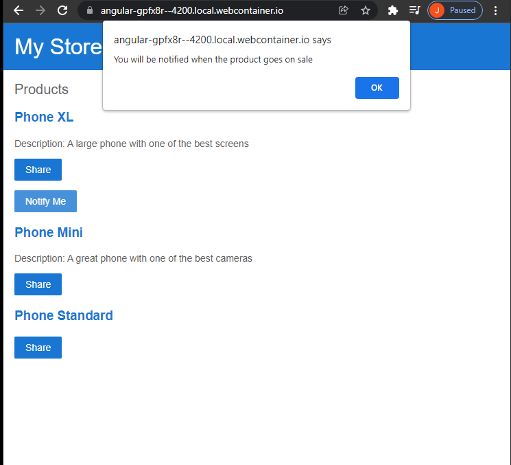

# Getting started with Angular
https://angular.io/start

Build an app
Components with structural directives, interpolation syntax, property binding, share method, events, component generation, data import, and decorators(id selector, html/css template).

